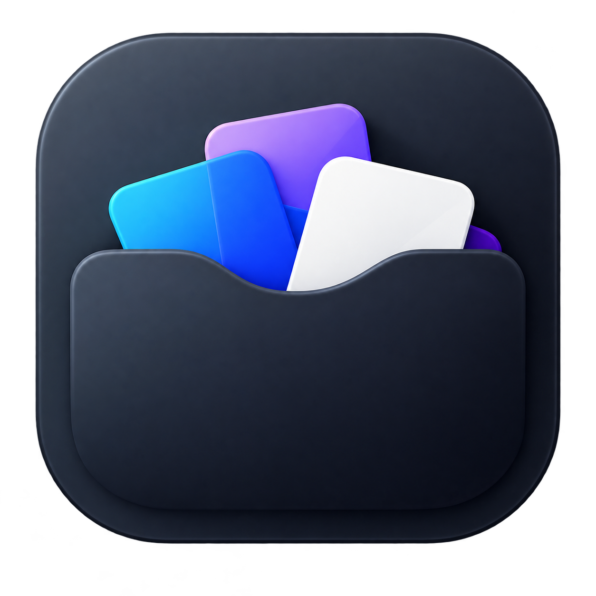
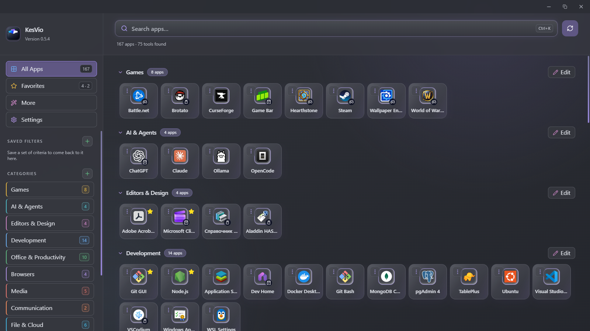
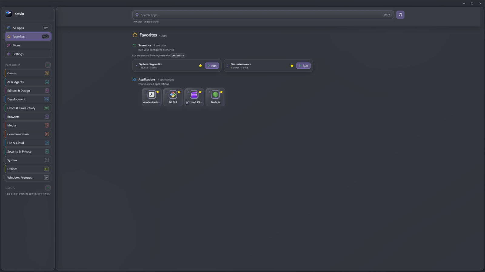
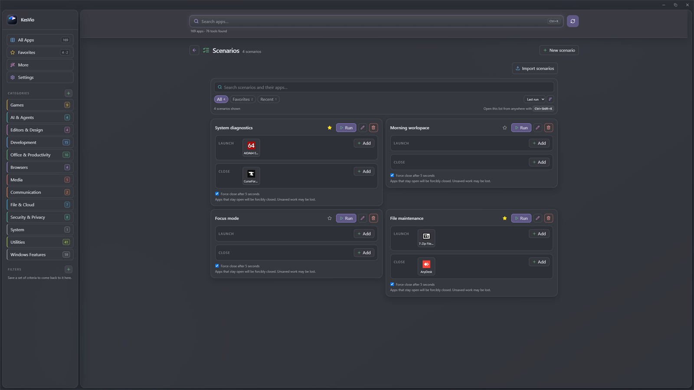
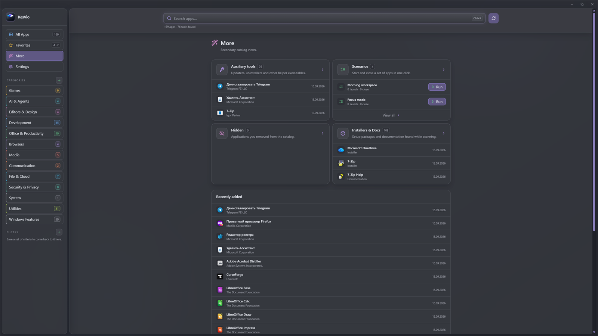
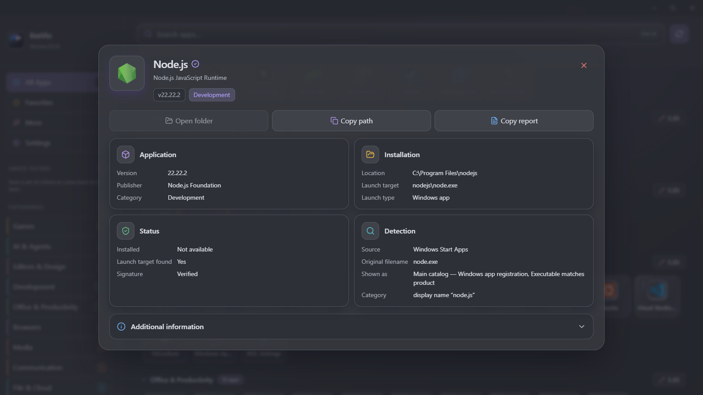
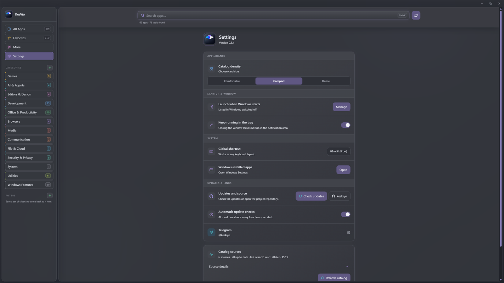

<p align="center">
  
</p>

<h1 align="center">AppNook</h1>

<p align="center">A local catalog for the Windows software you already use.</p>

<p align="center">
  AppNook finds Start Menu shortcuts, installed desktop programs, Microsoft Store apps, Steam games and portable executables.<br>
  It brings them together in one searchable catalog and merges duplicate entries into a single application card.
</p>

<p align="center">
  <a href="https://github.com/keskiyo/AppNook/releases/tag/v0.4.0"></a>
  
  
  
  
</p>

<h2 align="center"><a href="https://github.com/keskiyo/AppNook/releases/latest">⬇ Download AppNook</a></h2>

<p align="center">Windows 10/11 · x64 · Local-first</p>



Screenshots show AppNook 0.4.0 with an example catalog.

## One catalog for Windows software

Windows keeps applications in several places. AppNook combines:

- Start Menu shortcuts
- installed desktop programs
- Microsoft Store apps
- Steam games
- portable executables in folders you choose

When the same application is discovered from more than one source, it appears once rather than as a collection of duplicates.

## From discovery to launch

1. **Discover** Windows software, Steam games and selected portable-app folders.
2. **Organize** the catalog with categories, Favorites, Auxiliary tools and Scenarios.
3. **Launch** applications through their native Windows, Steam or executable path.

## Built for everyday use

### Search the catalog

Find applications by name, publisher, description or path, including typo-tolerant search.
Typing a name in Russian letters finds the Latin one, naming a category returns everything
filed under it, and when a match sits in another section the results say so and link
straight to it.

### Sort software it has never seen

Categories do not rely on a list of known products. AppNook reads the file types and
protocols an application registered with Windows, the purpose the vendor wrote into the file
description, and the Start Menu group the shortcut lives in — so an unfamiliar player, editor or
mail client still lands where it belongs.

### Keep one card per application

Shortcuts, registry entries, Store packages and other representations of the same program are merged into one card.

### Launch through the right system path

Steam games open through Steam, packaged apps through Windows and executables directly.

### Save useful setups

Favorites, categories and Scenarios let you keep common applications and launch-and-close setups close at hand.

## Favorites and Scenarios



Star applications for quick access, or run a Scenario that opens one group of applications and closes another.

## Scenario details



Choose which apps to launch or close and follow the Scenario's progress. Missing apps stay visible as **Unavailable**.

**Save your work first:** apps that do not close within five seconds are forcibly stopped, which can discard unsaved work.

## More catalog views



Auxiliary tools, hidden applications, installers and documentation stay available without crowding the main catalog.

## Application details



Inspect local file details, architecture, signature status and installation state for an application card.

## Settings and maintenance



Manage scanning, backups and unclassified apps under **Advanced**. Optional fixed-drive discovery uses **Force full scan**. AppNook remembers window placement and can stay in the tray; manage startup in **Windows Settings → Apps → Startup**.

Backups contain preferences only. If **Your changes are not being saved** appears, keep your export: imported settings may be lost after restart even when import reports success.

## Install

1. Download [**`AppNook_0.4.0_x64-setup.exe`**](https://github.com/keskiyo/AppNook/releases/latest).
2. Run the installer.
3. Start AppNook and choose **Scan for apps**.

> [!WARNING]
> Released installers are not Authenticode-signed yet, so SmartScreen may show **Windows protected your PC**. Choose **More info → Run anyway** and download only from this repository's Releases. See [Code signing policy](#code-signing-policy).

| Requirement  | Value                                                           |
| ------------ | --------------------------------------------------------------- |
| OS           | Windows 10 or 11                                                |
| Architecture | x64                                                             |
| Runtime      | Microsoft Edge WebView2                                         |
| Internet     | Update checks and downloads; WebView2 installation when missing |
| Account      | Not required                                                    |

## Privacy

AppNook is local-first. It has no telemetry, cloud account, application-inventory uploads or online metadata enrichment; catalog data remains on your machine. The updater contacts this repository's Releases to check for updates and download an installer when you choose to update. These requests do not include your catalog. If WebView2 is missing, the installer also needs internet access to download the runtime from Microsoft.

For implementation and security details, see [Technical Documentation](Documentation.md#13-privacy-and-security). AppNook is available under the [MIT License](LICENSE).

## Known limitations

- Windows 10/11 and x64 only.
- Released installers are not Authenticode-signed yet; SmartScreen may appear.
- Microsoft Edge WebView2 is required.

## Development

Prerequisites: Node.js 22, Rust 1.88+ with the MSVC toolchain, Microsoft C++ Build Tools, Windows SDK and the [Tauri Windows prerequisites](https://v2.tauri.app/start/prerequisites/).

```powershell
npm install
npm run tauri dev
```

See [Technical Documentation](Documentation.md#16-verification-and-releases) for verification and release commands.

## Contributing

Bug reports and pull requests are welcome. Read [Technical Documentation](Documentation.md) before changing code or workflows.

## Code signing policy

Released installers are not Authenticode-signed. There is no code signing certificate behind this project, so SmartScreen warns on first run and every release starts at zero reputation.

What is verified instead: each release is built from this repository by the GitHub Actions workflow in `.github/workflows/release.yml`, on GitHub-hosted runners, and every installer is published with a detached Tauri updater signature (`.sig`). The in-app updater verifies that signature against the public key in `tauri.conf.json` before it installs anything, so an installer altered after publication is rejected as an update. That signature is separate from Authenticode and does not suppress SmartScreen: download only from this repository's Releases.

AppNook has no telemetry or account, and the catalog it builds stays on the local machine. GitHub serves and logs update checks and installer downloads; Microsoft supplies the WebView2 runtime if it is missing during installation. See [Privacy](#privacy).

## Links

[Documentation](Documentation.md) · [Releases](https://github.com/keskiyo/AppNook/releases) · [Telegram: @keskiyo](https://t.me/keskiyo)
